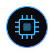
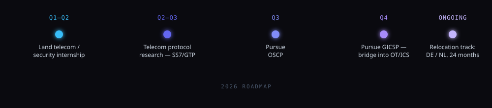
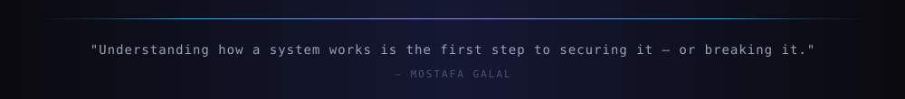

  

  

  
  
  
  

### About Me

I'm a final-year **Electronics & Communications Engineering** student who spends equal time in two worlds that most people keep separate: designing the systems that run on silicon, and breaking the ones that don't hold up under pressure. That split isn't a contradiction — understanding how embedded hardware and network protocols actually work is what makes the offensive side of my work precise instead of guesswork.

By day I'm building firmware, chasing signal integrity, and reasoning through circuits. By night I'm on HackTheBox chaining exploits, or reverse-engineering a binary until it gives up its secrets. Both disciplines demand the same thing: patience with complexity, and a refusal to accept "it just works" as an answer.

 

<table align="center">
<tr>
<td width="50%" valign="top">

#### ⚡ Embedded & Communications
- Digital communications — PCM, line coding, bandpass modulation
- Electrical machines — transformers, induction & DC motors
- ARM/AVR firmware and hardware-level attack surfaces
- RF & filter design (RLC / Butterworth band-pass, ngspice)

</td>
<td width="50%" valign="top">

#### 🛡️ Offensive Security
- Penetration testing — eJPT certified
- Binary exploitation, reverse engineering, pwn
- Telecom protocol security — SS7, Diameter, GTP, OT/ICS
- Active CTF player, team **DARXVEIL-ICMTC26**

</td>
</tr>
</table>

### 🎯 Right Now

- Chasing internships across telecom & cybersecurity in Egypt — completed a CIB summer internship with a perfect score
- Working toward **OSCP** and **GICSP** as the next certification milestones
- Building a long-term path toward **Critical Infrastructure Protection** and telecom protocol security, with an eye on relocating to Europe within the next two years
- Shipping personal projects — a fitness-RPG app with a real-time 3D muscle map, and a from-scratch cyberpunk portfolio site

### 🛰️ 2026 Roadmap

  

### 🧰 Toolbox

  
  
  
  
  
  

  
  
  
  
  
  

  
  
  
  
  

### 🗂️ Projects

** Security & Offensive Tooling**

| Project | What it does | Stack |
|:---|:---|:---|
| [**PrivEsc-Suite**](https://github.com/Mostafa-Galal-sudo) | Linux privilege-escalation framework — 180+ SUID vectors, 13 kernel CVEs, weighted risk scoring | Bash, Python |
| [**NM Analyzer**](https://github.com/Mostafa-Galal-sudo) | Static analysis engine for kernel modules — detects rootkit patterns via symbol-table heuristics | Python, ELF |
| [**TCP Full Scan Tool**](https://github.com/Mostafa-Galal-sudo) | Async full-port TCP scanner with banner grabbing and CSV export | Python, asyncio |

** Embedded & Hardware**

| Project | What it does | Stack |
|:---|:---|:---|
| [**S.W.A.R.M.**](https://github.com/Mostafa-Galal-sudo) | Autonomous rover with a live Flask/Socket.IO dashboard and multi-mode decision engine | Python, Flask, Arduino |
| [**SmartCar OS**](https://github.com/Mostafa-Galal-sudo/SmartCarApp) | Full-stack smart RC car — 9 control modes including voice, gyroscope, and computer-vision line-following | React, Arduino, WebSocket |

** AI & Applications**

| Project | What it does | Stack |
|:---|:---|:---|
| [**J.A.R.V.I.S.**](https://github.com/Mostafa-Galal-sudo) | Bilingual AI assistant with local/cloud hybrid inference and a custom cinematic HUD | Python, Ollama, Flask |
| [**FaceBlur Live**](https://github.com/Mostafa-Galal-sudo) | Real-time face detection & mosaic privacy tool with synced audio recording | Python, MediaPipe, FFmpeg |
| [**cybernetic-canvas**](https://github.com/Mostafa-Galal-sudo/cybernetic-canvas) | This portfolio, rebuilt — React + TanStack Router with hand-built interactive visualizations | React, TypeScript |

<a href="https://github.com/Mostafa-Galal-sudo?tab=repositories">→ full repository list</a>

### 📈 Activity

  

### 📡 Reach Me

  
  
  
  

  

